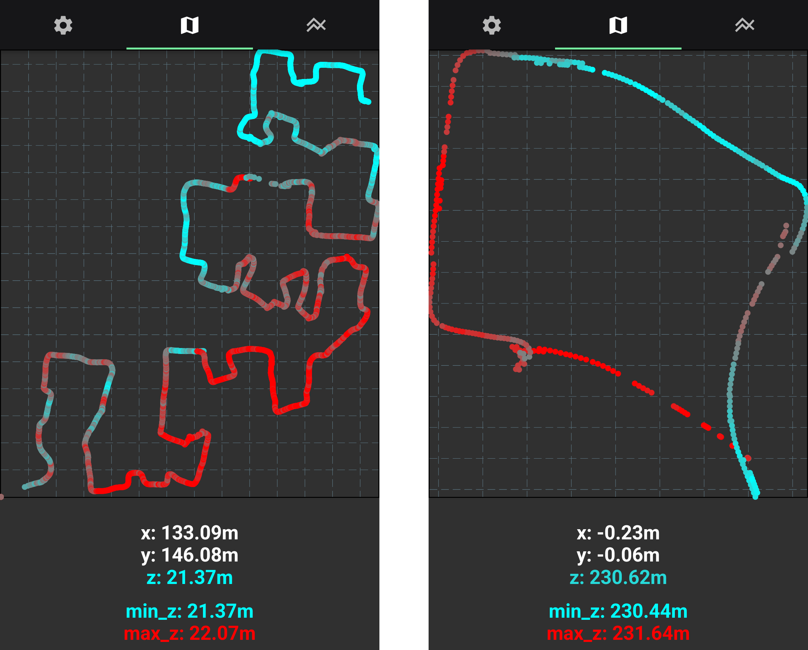

# earable_pdr
Pedestrian Dead Reckoning with [Open Earable](https://open-earable.teco.edu).

Positioning without GPS or terrestrial positioning systems, i.e., underground, is difficult.
Pedestrian dead reckoning can solve this problem by using a known starting point and integrating velocity and acceleration.
While many pedestrian dead reckoning applications place inertial-systems on the user's boots or chest, the Earable is worn in the user's ear and the phone in her pocket.
Therefore, the Flutter App shows that accurate positioning can be achieved without special hardware.

## Features
- understand the geometry of you route (e.g. how does the walked path inside an IKEA store actually look like)
- don't rely on GPS (e.g. underground)
- variable data rates independent of sensor polling rates
- gracefully handle sensor failure (i.e. BLE dropout, smartphone without barometer, ...)
- adapt to changing sensor accuracies
- Kalman Filter State also includes accuracy

## Used Sensors

Two inertial systems provide sensor readings to the app, one in the user's pocket and another in the user's ear.
These include:
- Earable magnetometer
- Earable gyroscope
- Earable accelerometer
- Phone barometer
- Phone Pedometer / Pedestrian Status (i.e., walking, standing, ...)
- Phone Compass

A Kalman Filter allows these sensor values to be combined in real-time and calculate the user's likely position.
It does this by first predicting the system's state using a state transition matrix and then updating that state based on observations using the observation matrix.
This detail is important because of the differing sensor polling rates:
While the prediction step is performed every constant time interval, partial update steps are performed whenever new sensor data arrives.

The state model assumes the heading and velocity to be static.
Changes in these variables are interpreted as normally distributed noise.

The Kalman Filter gracefully handles dropouts in the BLE connection with the earable or smartphones without barometers.
